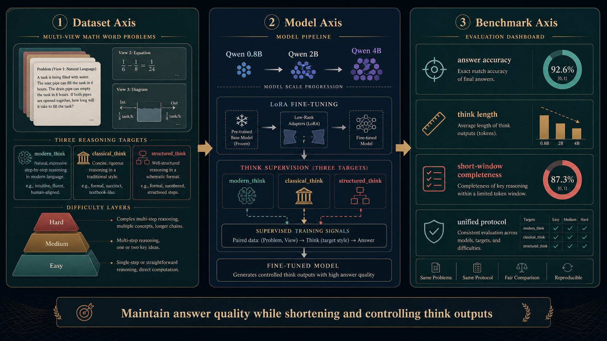

<div align="center">
  
</div>

<div align="center">

# 面向低参数中文模型的数学应用题 Think 压缩实验

<p>
  
  
  
  
  
  
</p>

<p><b>HUST AI&A 2023 Course Design Project</b></p>
<p>Dataset, Model, Benchmark</p>

</div>

> 关键词：`LoRA`、`Qwen`、`数学应用题`、`显式 think 监督`、`文言压缩`、`结构化 think`

## 导航

- [项目概述](#项目概述)
- [核心亮点](#核心亮点)
- [研究问题](#研究问题)
- [当前进展](#当前进展)
- [方法概览](#方法概览)
- [实验矩阵](#实验矩阵)
- [方法框架图](#方法框架图)
- [仓库结构](#仓库结构)
- [核心脚本](#核心脚本)
- [Case Study](#case-study)
- [快速开始](#快速开始)
- [文档入口](#文档入口)
- [参考 Run](#参考-run)
- [协作约定](#协作约定)

## 项目概述

本项目研究一个具体而窄的问题：

**在不明显损害答案正确率的前提下，能否通过数据集构建与监督方式设计，压缩小模型的 `think` 内容长度，并控制其语言风格与表达形式。**

当前主线围绕三种显式思维监督展开：

- `modern_think`
- `classical_think`
- `structured_think`

并比较它们在以下维度上的差异：

- 最终答案正确率
- `think` 长度与压缩程度
- 短生成窗口下的完整率
- 白话 / 文言输入下的风格对齐情况

## 核心亮点

- 显式监督 `<think>...</think>` 内部内容，而不是只监督最终可见答案
- 同时覆盖白话、文言与结构化三类思维表达
- 关注“小模型推理压缩”而不是单纯做题能力提升
- 训练、评测、案例抽样、协作文档都已进入同一仓库主线

## 研究问题

我们关心的不是“微调后能不能把题做对”这一个点，而是更细的权衡问题：

1. 能否在答案正确率基本保持的情况下，明显缩短 `think`
2. 白话、文言、结构化三类思维表达，哪一种更适合低参数模型
3. 在更短的生成窗口下，哪些监督形式更稳定
4. 当数据难度上升或过程变长时，压缩策略的边界在哪里

## 当前进展

当前项目已经完成第一阶段验证：

- 基于 `s800 / s800_think` 跑通了本地数据生成、LoRA 训练、规则评测与样例检查闭环
- 已证明显式 `think` 监督能够把基座模型默认的英文长推理，转成受控的中文 / 文言 `think`
- 当前 `Qwen/Qwen3.5-0.8B` 主线实验已具备继续扩展数据、模型和 Benchmark 的基础

当前代表性结论：

- `s800` 结构化监督主线：规则评测从 `55.0%` 提升到 `96.25%`
- `s800_think` 显式 `think` 监督主线：规则评测从 `55.0%` 提升到 `100%`
- 微调后模型可稳定输出白话 `think` 与文言 `think`

阶段判断：

- 第一阶段已经回答了“显式 `think` 监督是否可行”
- 当前项目已进入第二阶段：围绕 `Data Set / Model / Benchmark` 形成系统实验框架

## 第二阶段目标

第二阶段不再回答“显式 think 监督能否起作用”，而是系统回答三类问题：

### 1. Data Set

- 从当前小学难度主线扩展到更有层次的数据版本
- 保留“过程可压缩”这一核心属性，而不是盲目追求超高难度
- 统一数据字段、split 纪律与命名规则

### 2. Model

- 从当前 `0.8B` 主线扩展到 `2B / 4B`
- 系统比较 `modern_think / classical_think / structured_think`
- 分析不同监督形式在“压缩率-正确率”之间的权衡

### 3. Benchmark

- 固定统一的评测协议
- 在同一解码条件下比较 baseline 与 finetuned
- 同时记录规则准确率、复核准确率、输出完整率与 `think` 相关指标

## 方法概览

项目当前采用统一的三段式流程：

1. 构造同一道题的多视图样本  
   白话题面、文言题面，以及对应的 `modern_think / classical_think / structured_think`

2. 进行显式 `think` 监督或结构化可见输出监督  
   当前主线通过 `LoRA + Qwen` 微调，重点控制 `<think>` 内容本身

3. 在固定解码设置下评测  
   同时比较 baseline 与 finetuned，并记录规则结果、复核结果与压缩相关指标

## 实验矩阵

当前第二阶段的实验矩阵将沿三条轴扩展：

- 数据轴：小学 / 中学 / 高中 / 长过程压力样本
- 模型轴：`0.8B / 2B / 4B`
- 监督轴：`modern_think / classical_think / structured_think`

统一目标不是追求单点最高准确率，而是比较不同设置下：

- 正确率保持情况
- `think` 长度变化
- 压缩率与输出稳定性之间的权衡

## 方法框架图

<div align="center">
  
</div>

## Key Results

当前已落地并可复现的代表性结果如下：

| Setting | Focus | Baseline | Finetuned | Notes |
| --- | --- | --- | --- | --- |
| `s800` | structured visible-output supervision | `55.0%` | `96.25%` | 当前结构化监督主线在合成分布内已非常强 |
| `s800_think` | explicit `<think>` supervision | `55.0%` | `100%` | 微调后 `think` 从默认英文变为受控中文 / 文言 |
| `reference_v1` inspect | qualitative behavior | English long think | Chinese / classical aligned think | 已验证风格控制目标可达成 |

当前更重要的结论不是“单次准确率更高”，而是：

- 显式 `think` 监督确实改写了 `<think>` 内部内容，而不是只改善了答案格式
- 低参数模型的 `think` 可以被约束为白话、文言或结构化表达
- 下一阶段的重点应从“能否起作用”转向“不同压缩策略的权衡比较”

## 一眼看懂当前主线

| 维度 | 当前主线 |
| --- | --- |
| 任务目标 | 数学应用题 `think` 压缩 |
| 当前基线模型 | `Qwen/Qwen3.5-0.8B` |
| 下一阶段模型轴 | `0.8B / 2B / 4B` |
| 核心监督形式 | `modern_think / classical_think / structured_think` |
| 当前评测基线 | `eval_compare_full.py` |
| 协作入口 | `docs/STAGE2_EXECUTION_GUIDE.md` |

## Case Study

下面这组样例体现的不是“答案碰巧更准”，而是 `<think>` 内容本身的监督目标被真正学到了。

### Example A: modern question

**Question**

```text
小明有12颗糖，送给小红5颗，还剩几颗？
```

**Baseline tendency**

```text
<think>
[通常为英文长推理，长度较长，最终答案位置不稳定]
</think>
```

**Finetuned output**

```text
<think>
原来有12颗糖，送给小红5颗，所以用减法：12-5=7。
</think>

答案：7。
```

### Example B: classical question

**Question**

```text
明有糖12颗，遗红5颗，尚余几何？
```

**Baseline tendency**

```text
<think>
[通常仍为英文默认 think，无法随题面稳定切换到文言表达]
</think>
```

**Finetuned output**

```text
<think>
初有12颗，遗5颗，故12-5=7。
</think>

答案：7。
```

这两组样例说明：

- 微调后的变化发生在 `<think>` 内部，而不只是最终 `答案：N。`
- 白话题面与文言题面已经可以触发不同风格的思维表达
- 当前主线已经具备继续比较 `modern_think / classical_think / structured_think` 压缩效果的基础

## 仓库结构

```text
.
├── data/
│   ├── final/                 # 训练 / 验证 / 测试数据与摘要
│   └── interim/               # 对齐后的中间数据
├── docs/
│   ├── STAGE2_EXECUTION_GUIDE.md
│   ├── PROJECT_PROGRESS.md
│   ├── DATA_SCHEMA.md
│   ├── REPOSITORY_RULES.md
│   └── TEAM_SYNC_LOG.md
├── scripts/                   # 数据生成、训练、评测、抽样入口
├── src/                       # 可复用公共模块
├── pyproject.toml             # 主依赖入口
├── requirements.txt           # 兜底依赖清单
└── README.md
```

## 核心脚本

### 数据

- `scripts/generate_dataset.py`
  - 生成 `visible` 或 `think` 训练数据
  - 支持 `structured_think` 与按视图切换的 `think` 目标

- `scripts/validate_dataset.py`
  - 校验字段完整性、`messages` 格式与 `<think>` 包裹结构

### 训练

- `scripts/train_lora_local.py`
  - 当前默认主线模型为 `Qwen/Qwen3.5-0.8B`
  - 已支持通过 `--model-id` / `--model-tag` 扩展不同模型规模
  - 负责生成标准命名的训练 run 与 checkpoint

### 评测

- `scripts/eval_compare_full.py`
  - 当前正式基线评测入口
  - 已支持通过 `--model-id` / `--model-tag` 匹配不同模型主线
  - 规则答案抽取 + `DeepSeek V4 Flash` 复核

- `scripts/inspect_think_samples.py`
  - 已支持通过 `--model-id` / `--model-tag` 适配不同模型
  - 抽样查看 baseline / finetuned 模型在白话题、文言题上的 `think` 输出

## 快速开始

优先使用 `uv`：

```bash
uv sync
uv run python scripts/validate_dataset.py data/final/train_s800_think.jsonl --expect-think-tags
uv run python scripts/train_lora_local.py --dataset-tag s800_think --run-tag smoke
```

如果只需要兜底安装：

```bash
uv pip install -r requirements.txt
```

## 文档入口

1. [docs/STAGE2_EXECUTION_GUIDE.md](docs/STAGE2_EXECUTION_GUIDE.md)  
   第二阶段的统一分工、限制条件与协作规则。

2. [docs/PROJECT_PROGRESS.md](docs/PROJECT_PROGRESS.md)  
   已完成实验、阶段结论与当前主线判断。

3. [docs/DATA_SCHEMA.md](docs/DATA_SCHEMA.md)  
   数据字段规范与 `xxx_think` 命名规则。

4. [docs/REPOSITORY_RULES.md](docs/REPOSITORY_RULES.md)  
   仓库命名、目录职责、脚本使用方式与追溯要求。

5. [docs/TEAM_SYNC_LOG.md](docs/TEAM_SYNC_LOG.md)  
   组员接龙式协作日志。

## 参考 Run

- `runs/20260517_195355_train_s800_think_qwen3.5-0.8b_smoke_ref`
  - 全链路教学样板
  - 用来看目录结构、checkpoint 与日志产物

- `runs/20260517_203504_train_s800_think_qwen3.5-0.8b_reference_v1`
  - 当前正式参考训练模板
  - 后续新实验优先参考该参数配置

说明：

- 历史数据文件仍沿用 `s800 / s800_think` 路径，保证兼容
- 从现在开始，新的 run 目录名会把这类旧标签映射为更清晰的规范名，例如：
  - `s800` -> `synth_structuredthink_800_v1`
  - `s800_think` -> `synth_think_800_v1`
- 这样既不破坏旧文件，又能让后续 run 名更适合横向比较
- `model_tag` 也已进入统一命名层，后续 `0.8B / 2B / 4B` 会通过同一套 run 命名规则呈现

## 当前约束

- 所有显式思维监督字段统一使用 `xxx_think`
- 不新增新的 `xxx_cot` 字段族
- 新数据必须可追溯到 `source / family / split`
- 新评测不得私自修改现有 baseline 口径
- 重要结论必须落文档，不能只留在聊天记录中

## 运行环境

当前主力实验环境：

- Python `3.12`
- PyTorch `2.8.0`
- CUDA `12.8`
- GPU：RTX 4090 24GB
- 训练 / 评测环境：AutoDL Linux

## 协作约定

- 新结论写入 `docs/PROJECT_PROGRESS.md`
- 新任务分工与限制条件看 `docs/STAGE2_EXECUTION_GUIDE.md`
- 日常推进、实验目录、遗留问题统一追加到 `docs/TEAM_SYNC_LOG.md`

如果你是新加入本项目的同学，不需要先读全部代码。先看 `README`、`STAGE2_EXECUTION_GUIDE.md` 和 `DATA_SCHEMA.md`，再进入你负责的脚本与数据部分即可。
